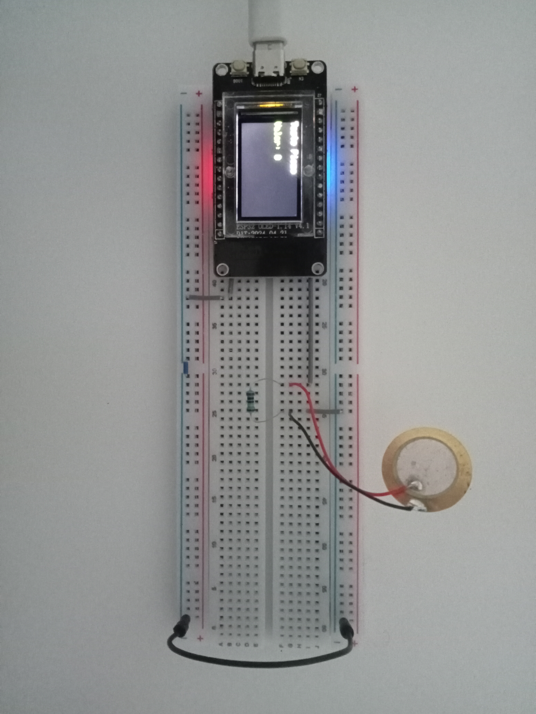
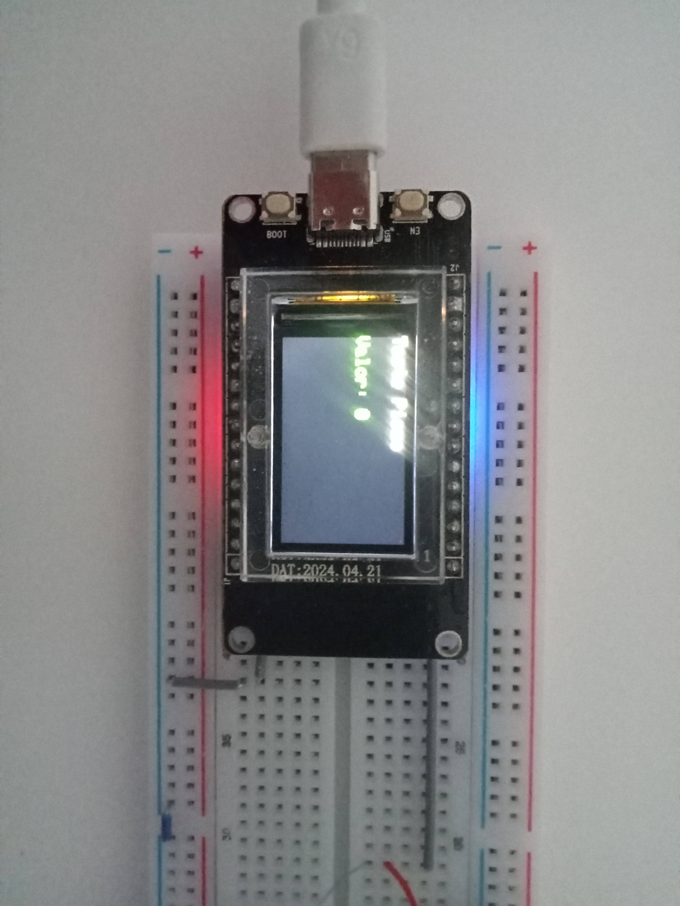
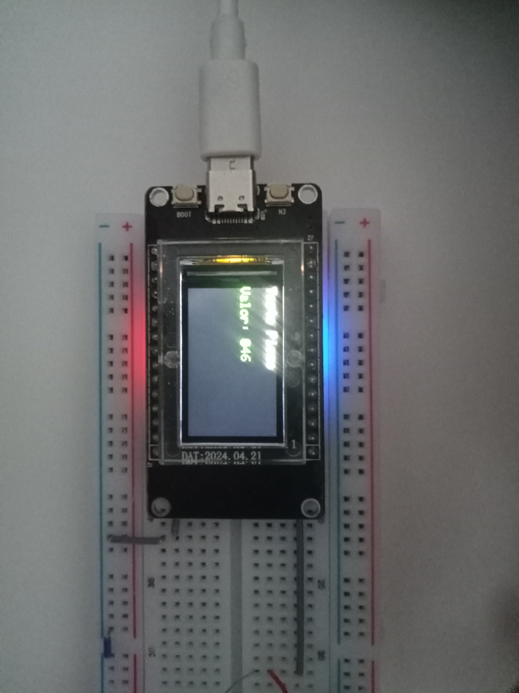

# README – Teste Piezo + ESP32 + TFT

## Descrição

Teste do sensor **piezo** com **ESP32** e **display TFT** para confirmar leitura de sinais e exibição dos valores.

---

## Componentes

* ESP32 com TFT integrado
* Piezo sensor
* Cabos de ligação
* Breadboard

---

## Circuito

---

## Display durante teste

---

## Informações mostradas

* **Valor do piezo** atualizado em tempo real
* Também mostrado no **Serial Monitor** para debug

---

## Próximos passos

* Adicionar **capacitor e resistor** para filtrar sinal do piezo
* Implementar **filtragem e thresholds**
* Preparar para **detecção de notas musicais** e exibição no TFT

---

## Objetivo do teste

- Confirmar que o piezo funciona e envia sinais detectáveis pelo ESP32

- Confirmar que o display TFT mostra corretamente os valores lidos

- Criar uma base para o circuito final e para o desenvolvimento do software do afinador